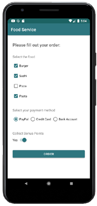
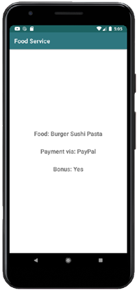

# Android App Library: Checkbox, RadioButton and Switch

## About
Welcome to our Android application. The app is part of the Open Sorce [Android App Library](https://github.com/LukPle/android-app-library.git) 
and adopts all licensing and community guidelines from this project. Please use the link in order to check out the corresponding repository.

The checkbox-radiobutton-switch app shows multiple methods for user input. The program contains **CheckBoxes**, **RadioButtons** and a **Switch**.
The values of these components get extracted and transfered to a second screen. The application serves as an example of these features.

## Features
The setting of the app is a system for making a food order. The first screen offers different input options to the user in order to specify the order. The user can choose
their food, payment method and if they want to collect bonus points. After clicking the Button for placing the order, all these values get shown in the next screen.  

## Usage
You can clone the repository into Android Studio by clicking "Get from VCS" in the Welcome Screen or navigating to "File - New - Project from Version Control" inside 
the IDE. When doing so use the URL provided by GitHub. You can run the app on your mobile device or an emulator. Feel free to modify the code or utilize this sample 
for your own project.
